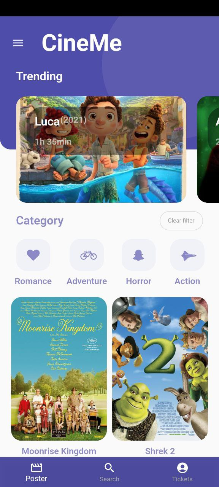
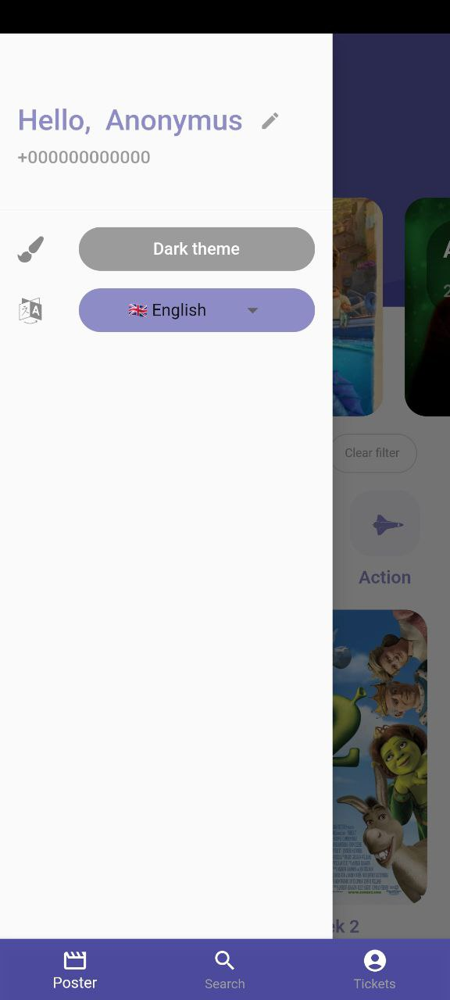
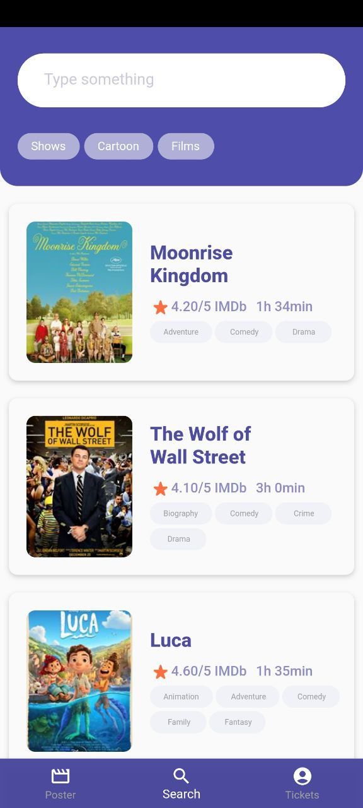
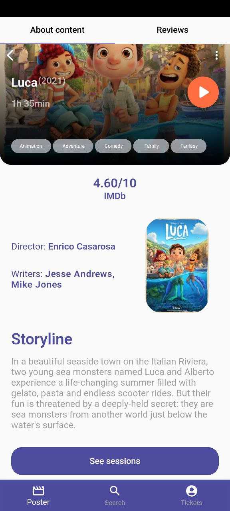
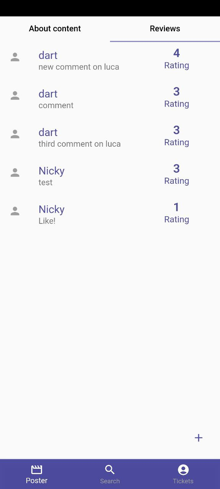
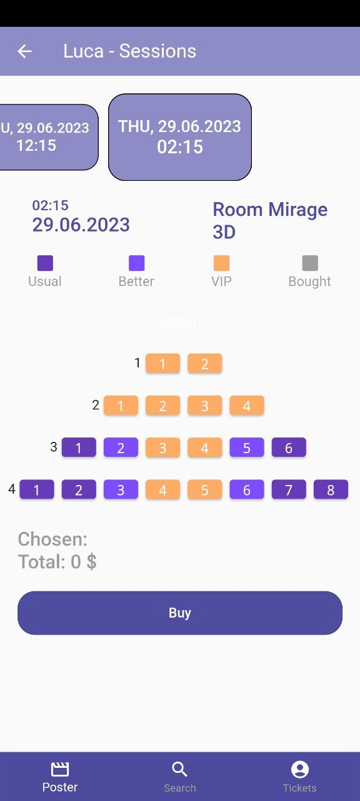
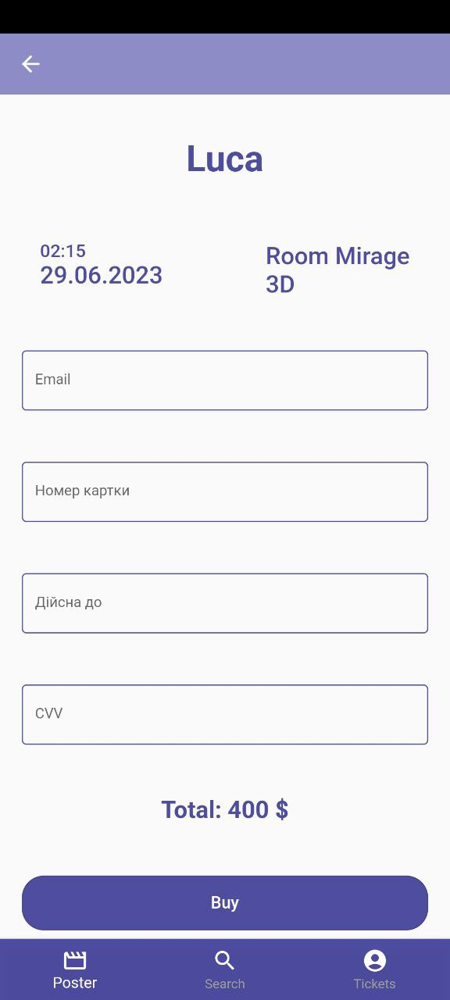

# CineMe - cinema tickets application
An application for buying and keeping tickets for cinema sessions.

### Functionality
- See posters
- Search on categories
- Dynamic search
- See film details, watch trailer
- View and add comments about the film
- See sessions, choose seats, buy tickets
- See bought tickets
- Change theme
- Change localization
- Change personal data 

### Technologies
- Flutter, Dart
- BLoC
- Provider
- GetIt
- Shared preferences
- Equatable
- Crypto, device info plus, meta
- Carousel slider
- Beamer
- Youtube player Flutter
- Barcode widget
- Share plus
- Dio
- Easy localization

### UI
#### Important!! - I am not the author of the UI. The author - https://dribbble.com/shots/6724418-Movie-app
  

