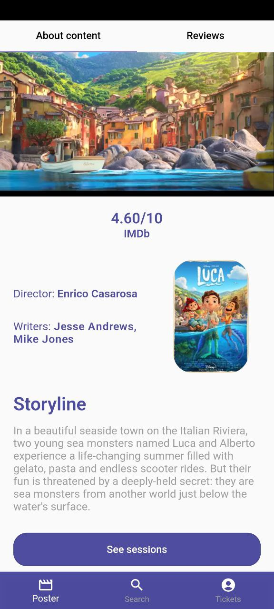
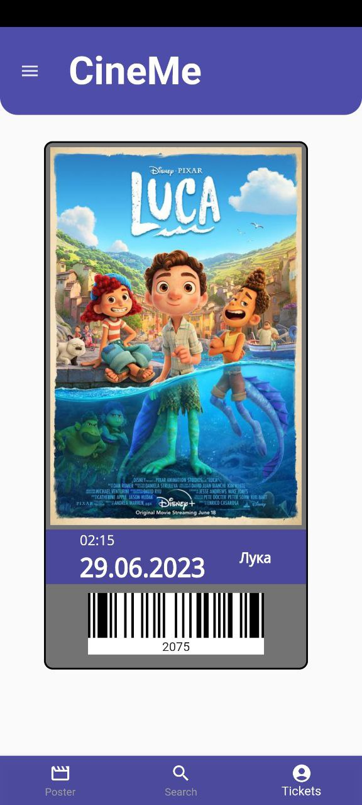

# CineMe - cinema tickets application
An application for buying and keeping tickets for cinema sessions.

### Functionality               | Technologies
--------------------------------| ----------------------------
See posters                     | Flutter, Dart
Search on categories            | BLoC
Dynamic search                  | Provider
See film details, watch trailer | GetIt
View and add comments           | Shared preferences
See sessions, choose seats      | Equatable
Buy tickets                     | Crypto, device info plus, meta
See bought tickets              | Carousel slider
Change theme                    | Beamer
Change localization             | Youtube player Flutter
Change personal data            | Barcode widget
                                | Share plus
                                | Dio
                                | Easy localization

### UI
#### Important!! - I am not the author of the UI. The author - https://dribbble.com/shots/6724418-Movie-app

<table>
  <tr>
    <td align="center">
      
    </td>
    <td align="center">
      
    </td>
    <td align="center">
      
    </td>
  </tr>
  <tr>
    <td align="center">
      
    </td>
     <td align="center">
      
    </td>
    <td align="center">
      
    </td>
  </tr>
  <tr>
    <td align="center">
      
    </td>
    <td align="center">
      
    </td>
    <td align="center">
      
    </td>
  </tr>
</table>
